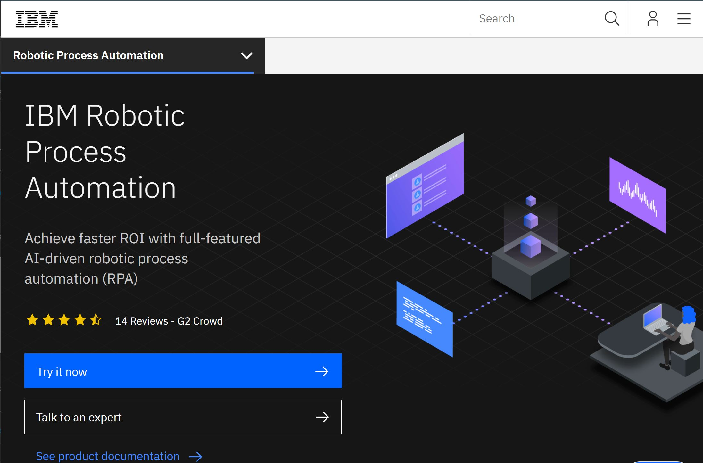
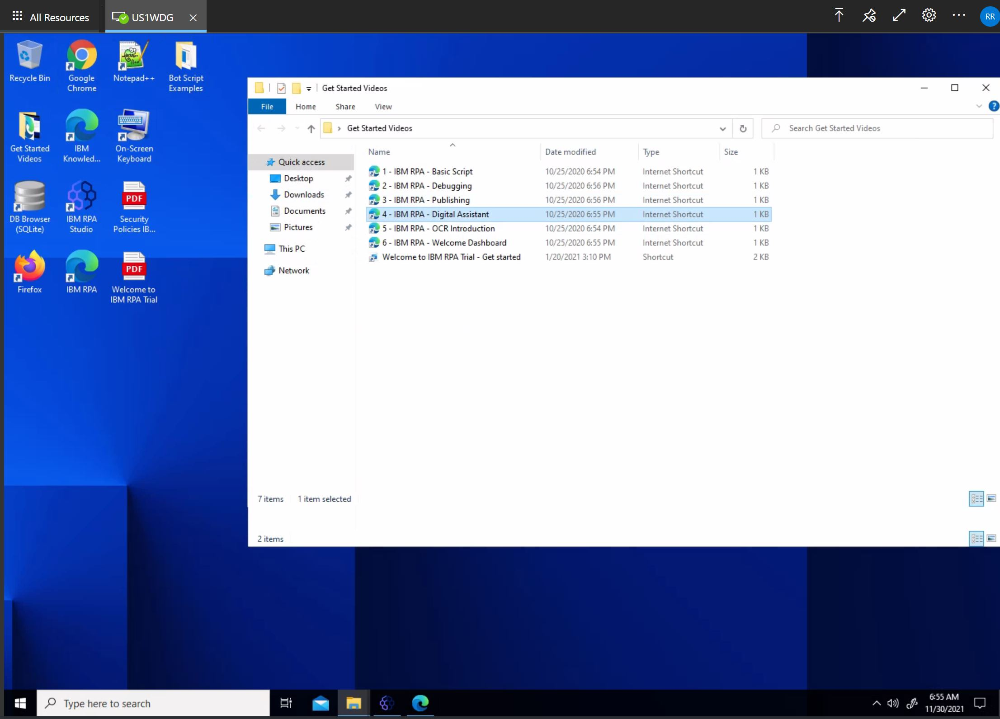
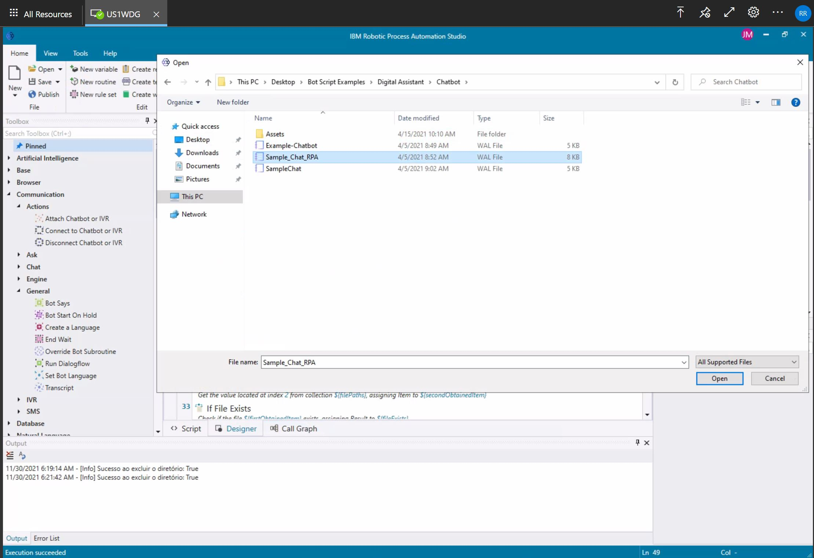
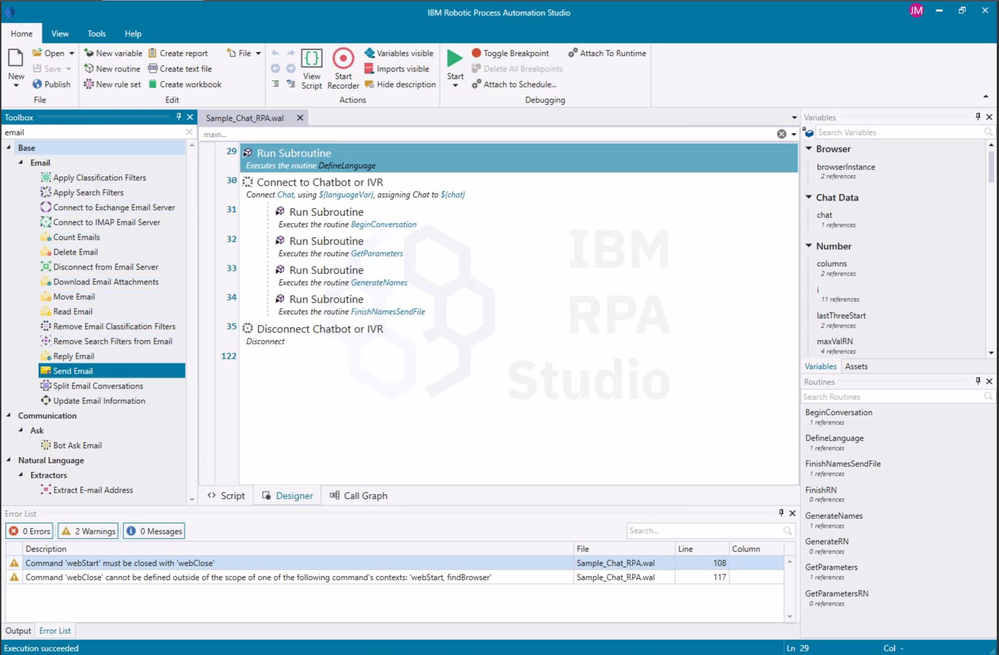

## RPA - The Emailing Chatbot.

In this challenge we invite the student to create a free IBM RPA lab account.

This will allow them to access a remote cloud desktop with the IBM RPA Studio and learning materials installed.

Please create an account and request a username and password (will take 15 minutes for your account to be created, and will be emailed to you).

After you create your account, please browse to https://rdweb.wvd.microsoft.com/arm/webclient/index.html and log in.

Watch the quick Video Tutorial, then proceed to watch the video tutorial on Chat Bots and IVR. 

You should now be equipped to modify a simple chatbot.

Open any of the example chatbots from the samples folder in IBM RPA Studio.

And then proceed to modify and add a Send Email action to send some communication from your ChatBot to yourself.m 

